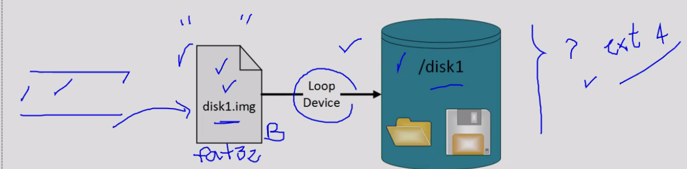

# Tema 2

En una base de datos real es muy importante definir el juego de caracteres, es por ello que debemos definirlo con cuidado desde un inicio porque modificarlo más adelante puede resultar algo complicado.

La desventaja de usar un juego de caracteres es que se necesita mayor almacenamiento. El juego de caracteres `AL32UTF8` es un juego de caracter masomenos dinámicos, si queremos guardar caracteres sencillos podríamos almacenarlos en 1 byte y si es más complicado en más bytes. Es el juego de caracteres recomenddo por Oracle.

#### Multiplexar

Significa que un archivo de la base de datos lo vamos a copiar o tendremos copias del archivo en más de 1 disco, buscamos replicarlo para evitar una falla. Si uno muere el sistema seguirá operando porque existe la posibilidad de que siga corriendo debido a que la disponibilidad aumenta.

#### Tamaño del bloque de datos

A nivel fisíco los datos se guardan en `DataFiles`, los archivos los vemos con terminación DBF.

<div align="center"></div>


Una vez que se define el tamaño de un bloque despues no se puede modificar.
La base de datos nos permite crear un table espace y a ese podemos pasarle un data file con un espacio diferente al que le indicamos al crear el primero.

Con el comando `sudo blockdev --getbsz /dev/sda5` se refiere al tamaño del bloque que tiene la partición.

Con el siguiente comando `df -h` podemos ver las particiones que tenemos.

Para mostrar el tamaño del bloque usamos el comando `show parameter db block size`.

La carga un bloque de datos en caché, pensariamos que al hacer un update o demás se hace en disco, pero no es así, se guarda en el caché y puede tardar más tiempo en verse reflejado exactamente en el disco.

Un **redo log**, cuando hacemos un update el  cambio está en el redo log, ahí se estarán almacenando los cambios, por ejemplo un update. Lanzar un commit es confirmarle a la base de datos que la transacción ya terminó y que los cambios hechos se hagan permanenetes, en ese momento lo guarda.

Al hacer commit no sólo lo guarda en la memoria, sino también en el redolog para que posteriormente lo guarda en el disco. Un redo log lo podemos ver como un respalda que almacena todo lo que va pasando en el DB caché. 

De entrada el tamaño de un RedoLog es más pequeño que un datafile, además permite una lectura y escritura más rápida.

Si tenemos muy mala suerte y el sistema falla y aparte el redo log también falla estamos en problemas porque hemos perdido datos, esto es lo peor que le puede pasar a un DBA.

Es por ello que buscamos multiplexarlos, una base de datos tipicas tiene **almenos 2 copias.**

Los data files tienen su tamaño de bloque y el redolog también tiene su bloque, el datafile tiene un tamaño mayor. El tamaño de bloque del redolog es menor porque sólo se guardan los cambios del caché, es decir, guarda sólo lo necesario pero no todo el registro.

La base nos recomienda 512 Bytes para evitar el desperdicio de almacenamiento en nuestro disco.

<div align="center"></div>

Con la siguiente consulta podemos ver el tamaño que está siendo desperdiciado: `select name, value from v$sysstat where name = 'REDO WASTAGE';`

Lo que hace lenta a una BD es la cantidad de accesos a disco.

**Sysaux** contiene datos adicionales de componentes a lo que vamos a instalar. Por defecto su tamaño debe ser de aproximadamente 400 MB. Su tamaño puede crecer.

**system** Es el table espace fundamental.

**users** Es el table espace para usuarios, para buenas prácticas todos los datos se deben guardar en un tablespace users.

**rollback** hace un retroceso a un commit anterior.  El manejador en algún lugar tiene que guardar la versión viejita para poder implementarlo en caso de ser necesaria, esta versión viejita se guarda en el `tablespace undo`, sólo lo guarda de forma temporal y no permanente. 

Al crear una base de datos se crean por default: `tmp, users, undo, system, sysaux`

**Fin tablespaces**

### Configurando base de datos a linea de comandos

La ventaja de hacerlo en linea de comandos es aprender todo el proceso. 
Automatizamos la creación de una base de datos sin tener que depender de una interfaz gráfica. (Esto nos permite ahorrar recursos).
En el ambito laboral el ambiente gráfico puede no existir, de hecho en casi todos es mediante una linea de comandos porque se hace para eficientar la base de datos y el desempeño del sistema.

Un archivo de parametros, como su nombre lo dice se encarga de indicar parametros necesarios.

PFILE --> Parameter File. Es un archivo de texto editable.
SFILE --> Server file. Es un archivo binario.

Es mejor usar un SFILE porque permite modificarlo mediante está en ejecución la BD. El de texto nos permite hacer respaldos de un SFILE. 
La propia base genera el `SFILE`.

### Creando un PFILE

Se crea de la siguiente manera: `db_name=ymmbda2` en el interior del archivo y se guarda en `$ORACLE_HOME/dbs` 

Cuando se crea una base de datos debemos crear un `PFILE` con los parámetros necesarios para su funcionamiento.

<div align="center"></div>

La plantilla PFILE sólo nos muestra un esquema con los parámetros necesarios para el inicio de la instancia.

`memory_target` la memoria total que usará nuestra instancia.

Nuestras instancias tienen hasta 1GB en la memoria.

`control_Files` aquí se guardan configuraciones y validaciones para que la base funciona correctamente. Si se pierde el archivo de control la base se cae y no puede iniciar. De este tipo de archivos hay que hacer un multiplexeo, para que evite que se caiga el archivo.

Por default al crear una BD se crean **2 archivos de control** y **3 redolog**

## Puntos de montaje

Un loop device es una especie de “pseudo-dispositivo” que permite a un archivo simple ser visto como un dispositivo de bloques (raw device), es decir, puede ser visto como un dispositivo de almacenamiento que puede contener un conjunto de archivos.

<div align="center"></div>

* `dd if=/dev/zero of=disk2.img bs=100M count=10` Va a rellenar con ceros un archivo binario y va a estar llenando con bloques de 100MB hasta que llegue a 1GB.
Se recomienda usar Shell para crear si no existe y eliminarlo si existe ya.

* `du -sh disk*.img` Podemos validar si ya fue creado el archivo

* `losetup -fP disk2.img` -f ubica y localiza el primer loop device disponible. La opción `-P` le dice al SO que revise bien cuantos dispositivos de almacenamiento tenemos.

* `losetup -a` Cuando lo ejecutemos el SO reconocerá que tenemos 2 nuevos dispositivos.

* El SO reconoce los dispositivos pero aun no reconoce el formato que tienen, es por ello que ejecutamos el siguiente comando que le dará el formato de `ext4`: `mkfs.ext4 disk2.img` 

* Creamos los directorios para montar los dispositivos. `mkdir /u02   \n mkdir /u03`

* Para hacer el punto de montaje: `mount -o loop /dev/loop0 /u02`

Despues de ejecutar el comando anterior podremos guardar archivos dentro de el. El comando Mount funciona pero al apagar la maquina los loopdevices se pierden, entonces cada que iniciamos la maquina deberiamos deberiamos repetir el proceso, entonces deberiamos hacer este siempre que iniciamos la maquina. (Este comando podría omitirse, porque no va en el Script)

Para evitar el anterior usamos el archivo `fstab` es una tabla de mapeo, nos permite montar de forma automatica al iniciar el sistema. <p style="color: red">Antes de modificar este archivo debemos asegurarnos que ya hayamos ejecutado el script anterior a modo que nuestros dispositivos ya existan.</p>

Como usuario root modificar el archivo `/etc/fstab` y poner las siguientes líneas:

```
#loop devices agregados para la materia BDA
#Asegurarse que los archivos img existan.
/unam-bda/disk2.img /u02 auto loop 0 0
```

<div align="center"></div>

Para comprobar lo anterior podemos usar el siguiente comando: `df -h | grep u0` el comando `df -h` nos muestra todos los archivos, el `-h` muestra el valor en humano para que podamos entenderlo. Con el `|` toda la salida es filtrada y nos mostrará algo así: 

<div align="center"></div>

### Script archivo de Passwords y parámetros.

Crear un script `s-02-crea-pwd-param-oracle.sh` que realice las siguientes acciones:

Este archivo de password debe estar en `$ORACLE_HOME/dbs` y este archivo de password debería llamarse `orapwymmbda2`

Como crear un archivo y modificarlo:

```
archivoParam = "${ORACLE_HOME}"/dbs/initymmbda2.ora

touch "${archivoParam}"

echo "db_name=ymmbda2" >> "${archivoParam}" #Debe ser doble > para que no sobreescriba

#Aquí iria el parámetro de memory_target
```

Ejemplo apuntando a otra ruta:

<div align="center"></div>

```
archivoParam = /tmp/prueba.txt

touch "${archivoParam}"

echo "db_name=ymmbda2" >> "${archivoParam}" 
echo "control_files=(/u01/app/oracle/oradata/YMMBDA2/control01.ctl, /u02/app/oracle/oradata/YMMBDA2/control01.ctl)" >> ${archivoParam}

```

<div align="center"></div>

Con el siguiente comando podemos validar que tanto el archivo de parametros y el de passwords fueron creados correctamente:

`ls -l $ORACLE_HOME/dbs/*<oracle_sid>*`

podemos poner `echo ?` para ver el status del comando, si da **0** está correcto.

### Crear archivo de parámetros en modo binario SPFILE

Recordemos que la base de datos debe crear la instancia. La ventaja de crear el binario es que la instancia puede modificar ese archivo cuando nosotros hagamos cambios.

Para crear el archivo SPFILE crear un script llamado `s-01-crea-spfile-ordinario.sql`.
Recordemos que el OracleSID debe estár apuntando a la base 2. Los archivos de passwords y de parámetros son los unicos suficientes para manejar una instancia, con ello podemos crear e iniciar una instancia en modo `mount` solo crea las areas de memoria, pero todavia sin tener conocimiento de quna base nueva. Es decir, podemos crear una instancia nueva si almenos tenemos el archivo de passwords y de parametros.

* `startup nomount` A partir del valor de OracleSID buscará el archivo de parametros, lo leerá e iniciará sólo con los parámetros indicados.

* `create spfile from pfile;` Leerá el archivo de texto creado con nuestros 3 parametros y a partir de el iniciará el PFILE.

La instrucción toma como entrada el archivo de parámetros de texto (PFILE) y genera un archivo binario
Server Parameter File (SPFILE) en la ubicación por default. En caso que alguno o ambos archivos no se encuentren en las ubicaciones por default, se especifican las rutas absolutas:

```
create spfile='/u01/oracle/dbs/test_spfile.ora'
from pfile='/u01/oracle/dbs/test_init.ora';
```

* Para verificar que se creó correctamente el SPFILE ejecutamos el siguiente comando: `!ls $ORACLE_HOME/dbs/spfile<iniciales>bda2.ora`

<div align="center"></div>

### Creando BD desde Consola

Para crear la BD desde consola podemos hacerlo mediante lo siguiente:

<div align="center"></div>

<div align="center"></div>

Cuando se llene uno pasará al otro, si se llenan los 3 podrán regresar al primero, pero para ese punto ya deberiamos haber respaldado en los `TableSpaces`, porque de no ser así todos los cambios serían sobreescritos en el espacio que tiene asignado el redolog.

El comando `Create database` no crea carpetas, para ello nosotros debemos construir la estructura.

**Character set** Es el juego de caracteres global.

**National character set** Tiene un fin más especifico, es para un juego diferente de caracteres para alguna columna o algo semejante como uso de caracteres especiales, acentos y demás.

