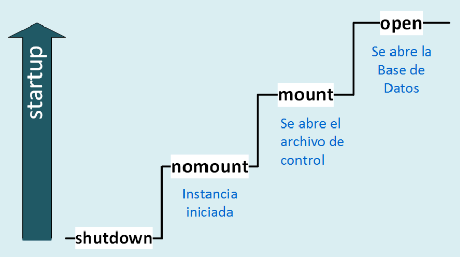
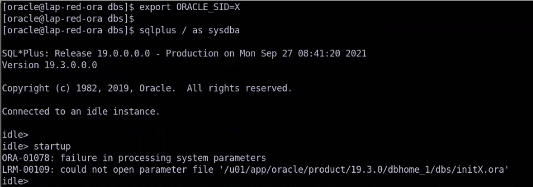

# Tema 3 Iniciar y detener una base de datos

En una operación normal de inicio, el comando startup, inicia la instancia, monta y posteriormente, abre una base de datos. Un usuario puede acceder a la BD una vez que esta se encuentra abierta.

Existen varios mecanismos para levantar una instancia:
* A través de SQL *Plus
* A través de Oracle restart
* A través del uso de Recovery Manager.
* Empleando Oracle Enterprise Manager Cloud Control

Para el caso del comando startup, como se comentó anteriormente, este puede ir acompañado del parámetro pfile para especificar la ruta absoluta donde se encuentra el SPFILE:

`startup pfile = /u01/oracle/dbs/mySpfile.ora`

## Maneras de iniciar una instancia

|Modo|Descripción|
|---|---|
|`shutdown`|La instancia se encuentra abajo o apagada|
|`startup nomount`|Inicia la instancia sin montar la Base de Datos.La instancia aún no es asociada a una base. Es el único modo que puede iniciar sin que exista una base de datos. En este modo **forzosamente debe existir el archivo de parametros**, si no existe el archivo de parámetros una instancia no se puede crear. |

* Se crean todas las áreas de memoria. 
* Los procesos de background son creados. 
* Se ubica y se lee el archivo de parámetros considerando el siguiente orden y nombres de archivos: 

* **Orden 1:** spfileSID.ora 
* **Orden 2:** spfile.ora

Orden 3: initSID.ora
En caso de no encontrar alguno de estos archivos, se produce error.
* En este modo no es posible acceder a la base de datos, inclusive puede no
existir.
* Se emplea generalmente para:
o Crear una nueva base de datos
o Re-crear archivos de control.
* Se escribe en el alert.log los parámetros configurados.
* En este modo se utilizan únicamente 2 archivos: archivo de parámetros y el
alert log.

* Si quisieramos entrar a una instancia que no existe, por ejemplo: `export ORACLE_SID=ymmbda2` y despues autenticamos como sistema operativo con `sqlplus / as sysdba` no nos marcará error, sin embargo, notaremos un mensaje que dirá que no pudo conectarse a la instancia, pero podremos "ejecutar" comandos. Si colocamos `startup` no podrá usar ninguna de las 3 opciones para levantar la instancia 

Vemos que dice que no podemos encontrar el sistema de parametros.

En resumen, **nomount** sólo buscará los archivos necesarios para levantar espacios en memoria sin tener que recurrir a la base de datos.

## Startup mount

Inicia la instancia, monta la BD. La instancia se asocia con una BD.

* Ubica y lee el contenido del archivo de control y lo lee. Su ubicación lo obtiene del parámetro control_files. Aquí si lee los archivos de control.
* Si existen varias copias estos deben ser idénticos, todos disponibles.
* En este estado la BD permanece cerrada, no se tiene acceso aun a ella.
* El DBA **puede realizar algunas tareas administrativas.**
* Se leen las ubicaciones y nombres de los data files y los online redo logs.
**Nota:**Solo se obtienen las ubicaciones. **Los archivos no se validan aun.** Esto se hace en la siguiente etapa.

## Startup open
Es equivalente a poner **startup** sin ningun parametro.

Se dice que una base está abierta cuando los usuarios pueden entrar a sus sesiones.

Inicial la instancia, monta la BD y se abre:

* A partir de las ubicaciones y nombres de los data files y online redo logs, se lee su contenido y se revisa si estos archivos están sincronizados. Es decir, todas las transacciones fueron sincronizadas. Si esto ocurre, se procede a abrir la BD. De lo contrario inicia el proceso de recuperación (se revisará más
adelante).
* Se obtiene un tablespace tipo undo para ser utilizado. Si existen múltiples tablespaces undo configurados, en el parámetro undo_tablespace indica cuál de ellos emplear. Si el parámetro no fue configurado, el primer tablespace tipo undo existente es el que se empleará.
* La BD puede ser accedida a partir de este momento.

## Startup force
Realiza un inicio forzado posterior a la ocurrencia de algún problema al detener o iniciar.

## startup open recover
Abre la BD y procede inmediatamente a realizar una posible recuperación de la base de datos: media recovery.

## Problemas que pueden ocurrir 
El inicio normal de la instancia y apertura de la BD puede verse afectada por problemas comunes como son:

* Archivo de control dañado o no disponible. A lo mucho que llega es a **nomount**
* Si alguno de los archivos especificados en el archivo de control no están disponibles, la BD no se podrá montar.