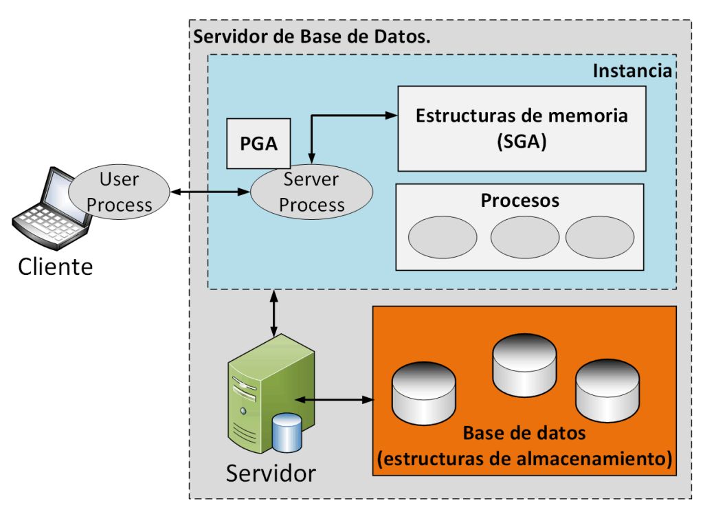

# Tema 4 Administración de las estructuras de Memoria

4.1. ARQUITECTURA BÁSICA DE UN SERVIDOR DE BASE DE DATOS.
* A nivel general, un servidor de bases de datos administra de forma segura grandes cantidades de datos en ambientes donde múltiples usuarios pueden acceder de forma concurrente.
* El servidor también previene accesos no autorizados.
* Proporciona soluciones para atender fallas a través del concepto de “database recovery”.

*Instancia y base de datos*
Un servidor de base de datos está formado por una base de datos y al menos una instancia de base de datos. Debido a que estos 2 conceptos están fuertemente ligados, suele emplearse el término “Base de datos Oracle” para hacer referencia a ambos.

* Base de datos: Conjunto de archivos localizados en disco que contienen datos. Estos archivos pueden existir independiente a la existencia de la instancia.
* Instancia: Conjunto de estructuras de memoria (SGA) que administran a los archivos que contienen datos. Formada a su vez por un conjunto de sub-áreas de memoria y por un conjunto de procesos de background.

<iframe src="apuntes/tema04" width="100%" height="680px"></iframe>